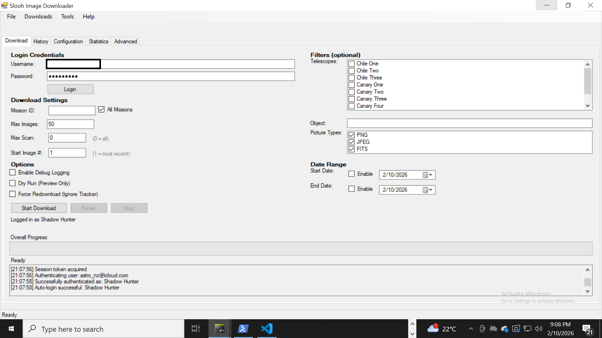
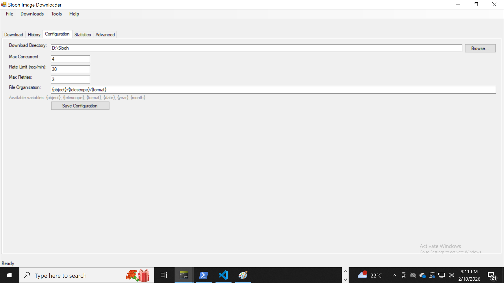

# Slooh Image Downloader

A standalone Windows desktop application for **bulk downloading** your Slooh astronomical images. Built with IronPython and .NET Windows Forms for easy local management and organization of your personal Slooh image library.


## Screenshots

### Main Download Window

*Download controls, filters, and real-time progress tracking*

### Configuration Tab

*Settings for credentials, folders, and download options*

## What Is This?

Slooh Image Downloader is a Windows application designed to help Slooh users **download all their astronomical images in bulk** for local storage and management on their PC. The recommended workflow is to **periodically download recent images by date** to maintain a complete local archive of all your Slooh observations.

### Why Use This Tool?

- **Bulk Downloads**: Efficiently download hundreds or thousands of images
- **Never Lose Images**: Keep local copies of all your Slooh observations
- **Organized Storage**: Automatically organize by object, telescope, and format
- **Fast & Efficient**: Multi-threaded downloads with batch processing
- **Smart Tracking**: Never re-download the same image twice
- **Flexible Filtering**: Download by date, telescope, object, or image type

## Key Features

### Download Management
- **Multi-threaded Downloads**: Configurable concurrent downloads (default: 4 threads)
- **Batch Processing**: Process 50 images per batch with detailed progress
- **Download Tracking**: JSON-based tracker prevents duplicate downloads
- **Pause/Resume/Stop**: Full control over download sessions
- **Rate Limiting**: Configurable API request rate (default: 30 req/min)
- **Retry Logic**: Automatic retry with exponential backoff

### Filtering & Selection
- **Date Range**: Download images from specific date ranges
- **Telescope Filter**: Select specific Slooh telescopes
- **Object Filter**: Filter by object name (partial match)
- **Image Type**: Choose PNG, FITS, or both
- **Start Image Number**: Begin from specific photoroll position
- **Max Limits**: Control scan depth and download count

### Organization
- **Template-Based Paths**: Organize files using patterns like `{object}/{telescope}/{format}`
- **Automatic Folders**: Creates directory structure automatically
- **Metadata Preservation**: Saves image metadata and timestamps

### User Interface
- **Windows Forms GUI**: Native Windows look and feel
- **Real-Time Progress**: Batch progress with file counts
- **Log Window**: Detailed status messages
- **Five Tabs**: Download, Configuration, History, Statistics, Advanced
- **Export Reports**: CSV and HTML export of download history

## Quick Start

### Prerequisites
- Windows OS
- IronPython 3.4+ ([Download](https://ironpython.net/) or `choco install ironpython`)
- .NET Framework 4.6.2+ (usually pre-installed on Windows)
- Active Slooh account

### Installation

1. **Install IronPython**:
   ```powershell
   choco install ironpython
   ```

2. **Clone or Download this repository**

3. **Launch the application**:
   
   **Option 1: Using PowerShell Launcher (Recommended)**
   ```powershell
   .\launch.ps1
   ```
   
   **Option 2: Direct Launch**
   ```powershell
   cd SloohDownloader\src
   ipy gui_main.py
   ```
   
   **Option 3: Create Desktop Shortcut**
   - Right-click `launch.ps1` → **Send to** → **Desktop (create shortcut)**
   - Or right-click `launch.ps1` → **Create shortcut** → Move to Desktop
   - Double-click the shortcut to launch anytime

### First-Time Setup (2 minutes)

1. **Configuration Tab**:
   - Enter your Slooh username and password
   - Set download folder (e.g., `C:\Slooh\Images`)
   - Click **Save Configuration**

2. **Download Tab**:
   - Click **Login** button
   - Wait for "Logged in successfully"

3. **Ready to Download!**

### Recommended Workflow

**First Time - Download Everything**:
1. Go to **Advanced Tab**
2. Set **Start Date** to when you started using Slooh
3. Click **Start Download**

**Monthly/Weekly Updates**:
1. Go to **Advanced Tab**
2. Set **Start Date** to your last download date
3. Click **Start Download**
4. Tracker automatically skips already-downloaded images

## Documentation

- **[README.md](SloohDownloader/README.md)**: Complete feature documentation
- **[QUICKSTART.md](SloohDownloader/QUICKSTART.md)**: Step-by-step quick start guide

## Project Structure

```
SloohDownloader/
├── launch.ps1                # PowerShell launcher script ← EASY START
├── README.md                 # This file - project overview
├── QUICKSTART.md             # Quick start guide
├── RELEASE.md                # Release documentation
├── SloohDownloader/
│   ├── README.md             # Full documentation
│   ├── QUICKSTART.md         # Step-by-step quick start guide
│   └── src/
│       ├── gui_main.py       # Main GUI application
│       ├── config_manager.py     # Configuration handling
│       ├── download_tracker.py   # Download tracking
│       ├── logger.py             # Logging system
│       ├── slooh_client.py       # Slooh API client
│       ├── download_manager.py   # Multi-threaded downloader
│       ├── batch_manager.py      # Batch coordinator
│       ├── file_organizer.py     # File organization
│       └── report_generator.py   # Export reports
├── config/
│   └── config.json           # Configuration (auto-created)
└── data/
    ├── download_tracker.json # Download history (auto-created)
    └── logs/                 # Log files
```

## Technology

**Built With**:
- **IronPython 3.4+**: Python implementation for .NET
- **.NET Framework 4.6.2+**: Windows runtime
- **Windows Forms**: Native Windows GUI
- **System.Net.Http**: HTTP client for downloads
- **JSON**: Configuration and tracking storage

**Why IronPython?**
- Direct .NET integration without P/Invoke
- Native Windows Forms GUI
- No external dependencies (no pip packages needed)
- Easy distribution (single executable possible)
- Modern Python 3 syntax support

## Download Tracker Explained

⚠️ **Important**: The download tracker records what has been downloaded - it does NOT monitor your file system.

- **What it does**: Records successfully downloaded images to prevent duplicates
- **What it doesn't do**: Check if files still exist on disk
- **If you delete files**: They remain marked as "downloaded" in tracker
- **Solution**: Use **Force Redownload** checkbox to re-download anything

## Related Projects

**Slooh.Explorer** (C#): Desktop application for exploring and managing Slooh images locally. Complements this downloader by providing image viewing and organization after download.

## Contributing

Contributions are welcome! This is an independent project focused on providing bulk download capabilities for Slooh users.

## License

MIT License - Copyright (c) 2021-2026 Calteo

See [LICENSE](LICENSE) file for details.

## Disclaimer

This is an unofficial tool created by the community. Not affiliated with or endorsed by Slooh. Use responsibly and respect Slooh's terms of service.
